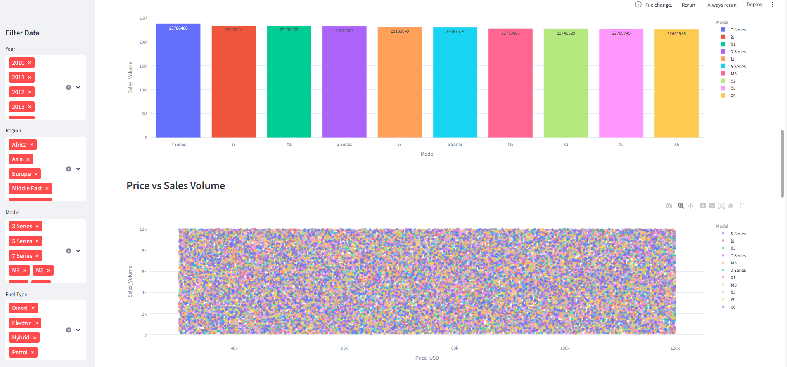
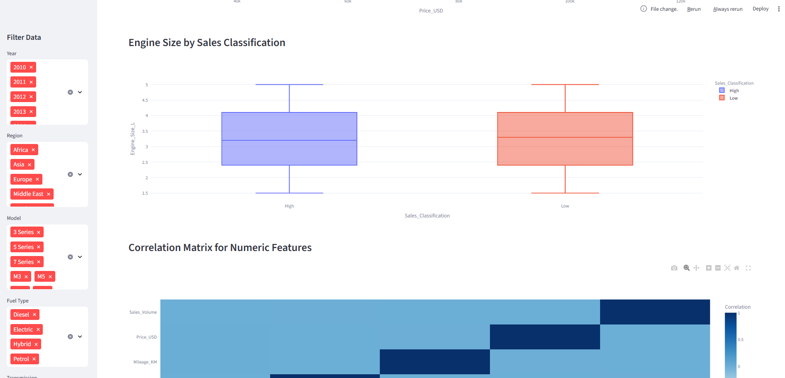

# BMW Car Sales Dashboard




## Overview
This interactive dashboard allows you to explore and visualize BMW car sales data across different years, regions, models, and more. Built with Streamlit and Plotly, it provides dynamic filtering, insightful charts, and downloadable data for your own analysis.

## Features
- Interactive filters: Year, Region, Model, Fuel Type, Transmission, Color
- Key Performance Indicators (KPIs) for quick insights
- Dynamic, interactive charts (Plotly):
  - Sales trend over years
  - Sales distribution by region (Pie)
  - Top 10 selling models
  - Price vs Sales Volume
  - Engine Size vs Sales Classification
  - Correlation matrix
  - Price and Engine Size distributions
- Download filtered data as CSV
- About/Instructions section
- BMW logo and custom branding

## Setup & Usage
1. **Clone the repository:**
   ```bash
   git clone https://github.com/yourusername/your-repo-name.git
   cd your-repo-name
   ```
2. **Create and activate a virtual environment (optional but recommended):**
   ```bash
   python -m venv venv
   # On Windows:
   .\venv\Scripts\activate
   # On Mac/Linux:
   source venv/bin/activate
   ```
3. **Install dependencies:**
   ```bash
   pip install -r requirements.txt
   ```
4. **Run the dashboard:**
   ```bash
   streamlit run bmw_sales_dashboard.py
   ```
5. **Open your browser:**
   Go to the link shown in the terminal (usually http://localhost:8501)

## Data
- The dataset used: `BMW_Car_Sales_Classification.csv`
- (Optional) Replace with your own data for other car brands or sales analytics.

## Screenshot


## Credits
Developed by **Sofien Meftahi**

---
Feel free to fork, star, or contribute to this project! 
